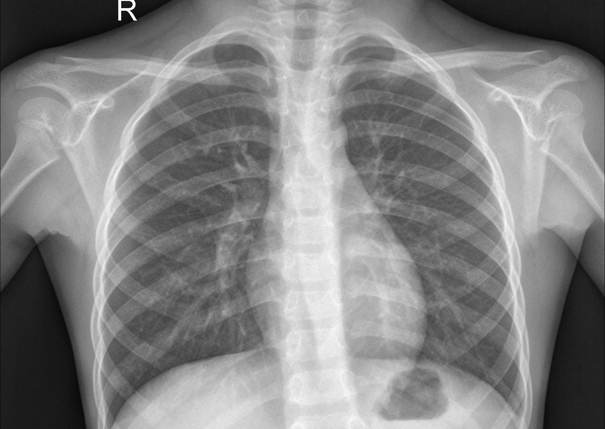
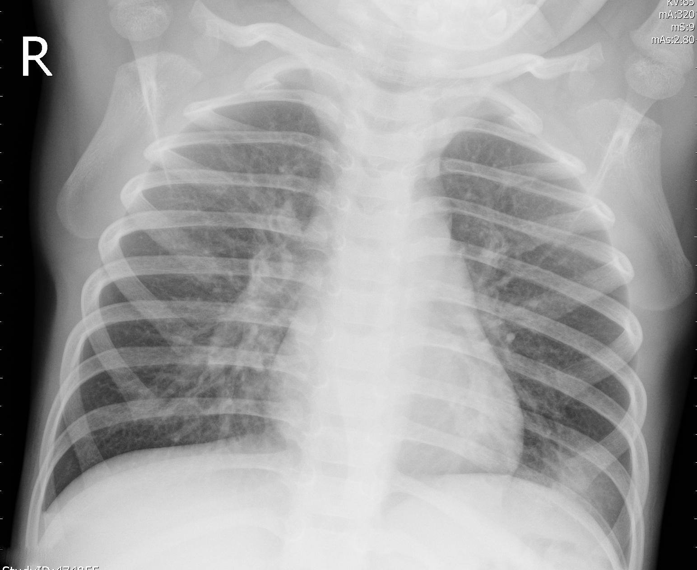
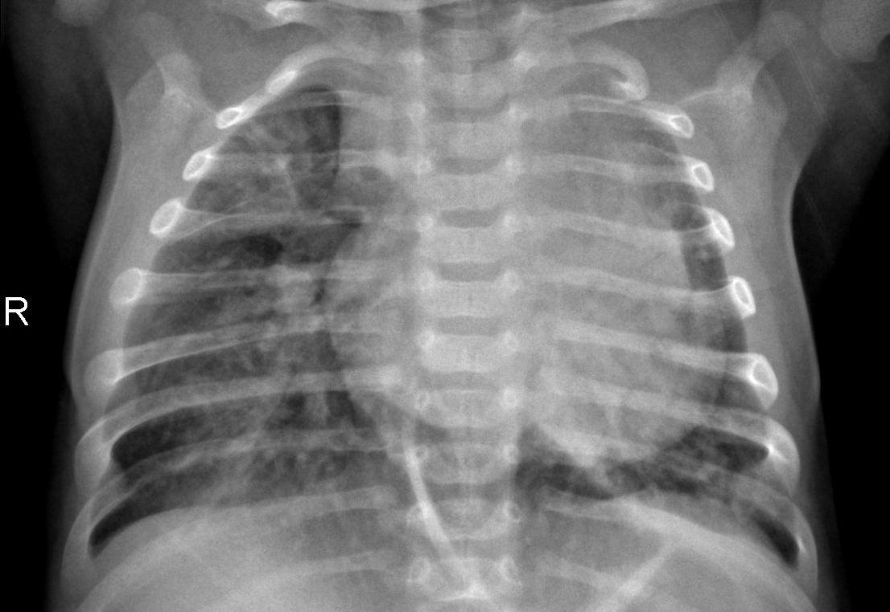
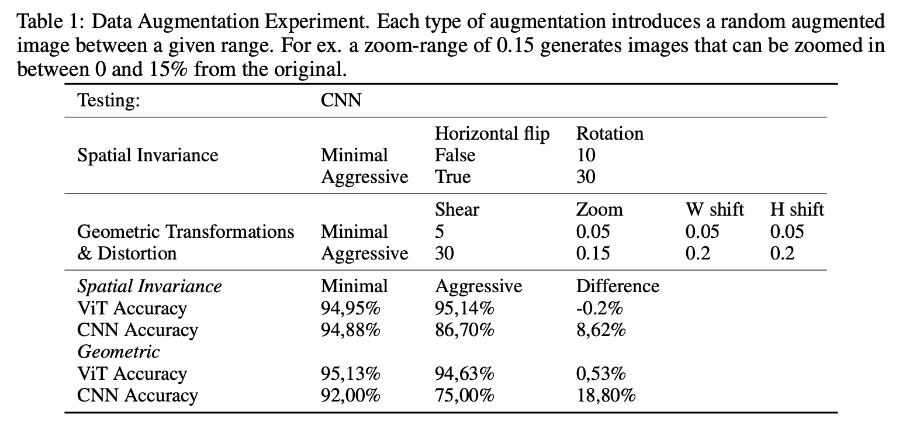
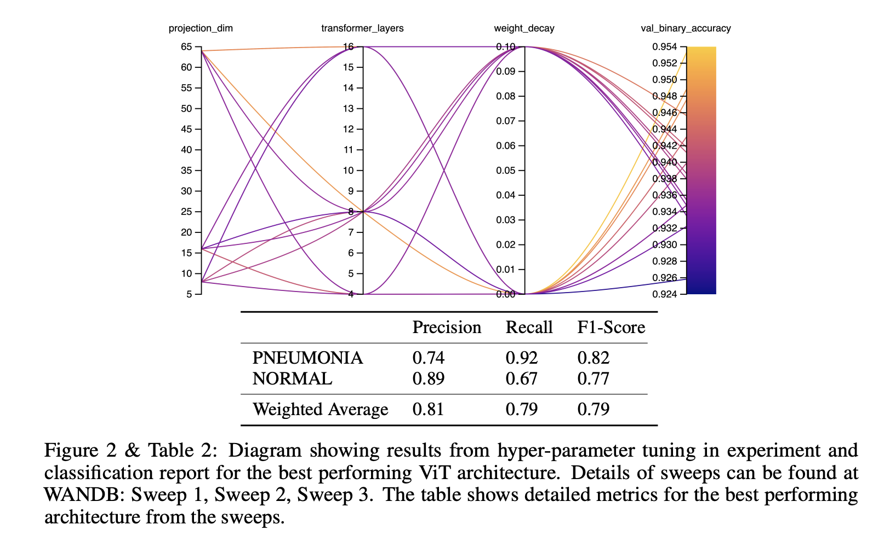

# 🩻 Vision Transformer for X-Ray Pneumonia Detection

**A from-scratch ViT that outperforms a CNN baseline on chest X-ray classification — and trains up to 5× faster.**

**[🚀 Try the live app →](https://vitpneumovision.streamlit.app/)**

---

## Overview

The Vision Transformer (ViT) has recently emerged as a viable alternative to the classical CNN for computer vision problems. This project builds a ViT **from scratch** to investigate how it stacks up against a CNN baseline on a real diagnostic imaging task: classifying chest X-rays as **NORMAL** or **PNEUMONIA**.

Inspired by an open-source Keras implementation, our ViT reaches **93.73% classification accuracy**, edging out our CNN baseline's 91.19% — while also proving considerably more resilient to aggressive data augmentation and dramatically faster to train.

| | ViT (ours) | CNN (baseline) |
|---|:---:|:---:|
| **Accuracy** | **93.73%** | 91.19% |
| **Training time** | up to **5× faster** | 1× |
| **Sensitivity to augmentation** | Low | High |

---

## Dataset

**5,863 binary-labeled chest X-ray images**, sourced from Kermany et al., *"Identifying Medical Diagnoses and Treatable Diseases by Image-Based Deep Learning."* Images fall into two classes:

- **NORMAL** — healthy patients
- **PNEUMONIA** — bacterial or viral pneumonia (both grouped under a single label)

  
  
  

Left to right: Normal · Viral pneumonia · Bacterial pneumonia

---

## Methods

The project unfolded in three stages:

1. **Baseline viability** — build both a ViT and a CNN, establish that the ViT is competitive
2. **Augmentation robustness** — test each architecture's reaction to aggressive image augmentation
3. **Hyperparameter sensitivity** — sweep ViT-specific hyperparameters to find what actually moves the needle

  

### Hyperparameter tuning

Sweeping the ViT's hyperparameters surfaced a few clear patterns:

- **Low weight decay** consistently produced higher accuracy
- Different combinations of **transformer layer count** and **projection dimension** converged on similar accuracy — the model is fairly forgiving here
- **Input image dimension**, **projection dimension**, and **number of transformer layers** were the most sensitive levers overall
- Best accuracy came at an image dimension of **72px** — though larger dimensions didn't meaningfully hurt accuracy either (see Section 5.4)
- Smaller image dimensions **halved training time** and reached peak accuracy in fewer epochs

The best-performing configuration was evaluated on a held-out test set of 500 images:

| Split | F1 Score |
|---|:---:|
| Validation | 91.8% |
| Test | 79% |

The drop on test is most likely mild overfitting — the dataset has only ~1,000 NORMAL samples to work with.

  

---

## Results

> **Our ViT achieved 93.79% accuracy, versus 91.19% for our CNN baseline — while training up to 5× faster.**

- ✅ **Accuracy** — the ViT edges out the CNN on this binary classification task
- ✅ **Training speed** — up to 5× faster to reach comparable results, meaningfully lowering compute cost
- ✅ **Augmentation robustness** — the ViT's inherent properties make it considerably less sensitive to aggressive data augmentation than the CNN
- ⚠️ **Data hunger** — the ViT needs more training data than the CNN to hit optimal performance
- ⚠️ **Scaling to complexity** — early experiments on the multi-labeled NIH dataset showed performance degrading quickly on more complex, multi-class problems, likely requiring pre-training as suggested by Dosovitskiy et al. (2020)

We couldn't draw firm conclusions about sensitivity to input image size specifically — that remains an open question for this dataset.

---

## Try it yourself

The trained model is deployed as an interactive Streamlit app — upload a chest X-ray and get a live classification with confidence scores.

### **[vitpneumovision.streamlit.app →](https://vitpneumovision.streamlit.app/)**

---

## Conclusion

Transformers for computer vision are a relatively young area, and this project adds one more data point in their favor: a ViT trained from scratch can match — and in this case beat — a CNN baseline on real diagnostic imaging, while cutting training cost significantly. That said, the ViT's appetite for data and its struggles on more complex multi-label problems are real limitations worth keeping in mind before reaching for it over a CNN by default.

As Dosovitskiy et al. (2020) suggested, pre-training looks like the likely path forward for scaling ViTs to harder vision problems — and it's an obvious next step for extending this work beyond binary classification.

---

Built with PyTorch · Deployed with Streamlit

